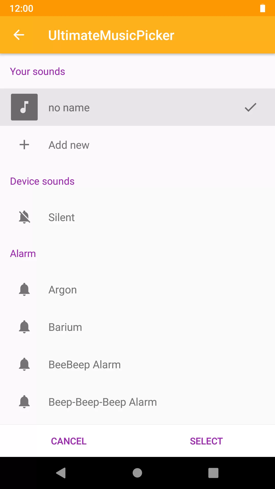
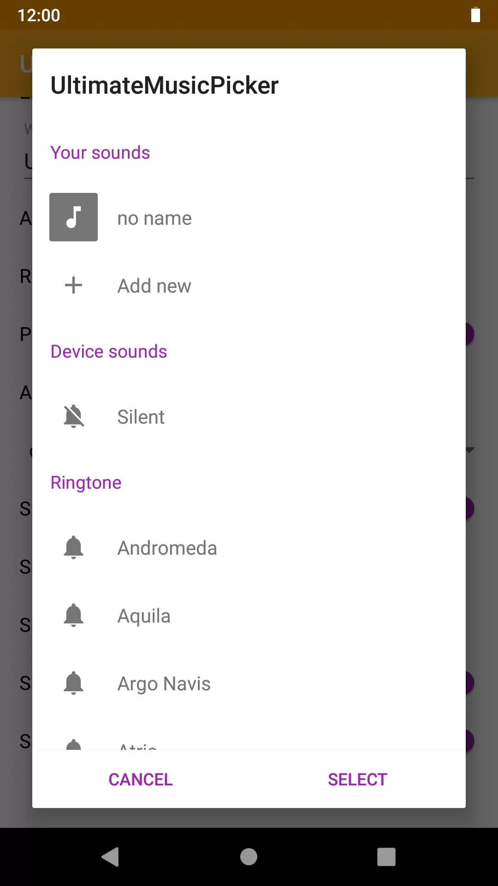
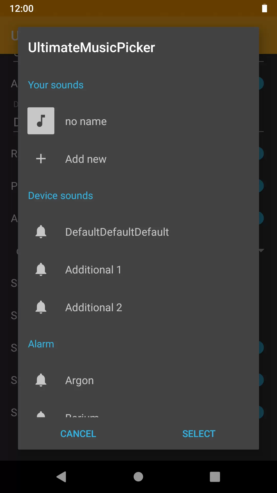

<div align="center">
  
</div>

<h1 align="center">UltimateRingtonePicker</h1>

<div align="center">
  <strong>Pick ringtone, notification, alarm sound and ringtone files from external storage with an activity or a dialog</strong>
</div>
</br>
<div align="center">
    <a href="https://android-arsenal.com/details/1/7141">
        
    </a>
    <a href="https://travis-ci.org/DeweyReed/UltimateRingtonePicker">
        
    </a>
    <a href="https://jitpack.io/#xyz.aprildown/UltimateRingtonePicker">
        
    </a>
    <a href="https://android-arsenal.com/api?level=14">
        
    </a>
</div>
</br>

## Features

- Respects Scoped Storage(MediaStore is used)
- Available as an Activity and a Dialog
- Options to pick alarm sound, notification sound, ringtone sound, and external ringtones.
- Ringtone preview
- An interface to set a default entry
- An interface to add custom ringtone entries
- Sorted external ringtones with artists, albums and folders
- Automatically remembers which external ringtones users have picked
- Multi-select
- Dark theme support out of box
- Permissions are handled internally
- Storage Access Framework support

The library is inspired by [AOSP DeskClock RintonePickerActivity](https://android.googlesource.com/platform/packages/apps/DeskClock/+/refs/heads/master/src/com/android/deskclock/ringtone/RingtonePickerActivity.java).

## Screenshot

||||
|:-:|:-:|:-:|
||||

## Gradle Dependency

Step 1. Add the JitPack repository to your build file

Add it in your root build.gradle at the end of repositories:

```Groovy
allprojects {
    repositories {
        ...
        maven { url 'https://jitpack.io' }
    }
}
```

Step 2. Add the dependency

[](https://jitpack.io/#xyz.aprildown/UltimateRingtonePicker)

```Groovy
dependencies {
    implementation 'xyz.aprildown:UltimateRingtonePicker:3.0.0'
}
```

## Usage

[Demo APK](https://github.com/deweyreed/ultimateringtonepicker/releases) and [examples in the MainActivity](./app/src/main/java/xyz/aprildown/ultimateringtonepicker/app/MainActivity.kt).

### 0. Add Permission

Add `<uses-permission android:name="android.permission.READ_EXTERNAL_STORAGE" />` to your Manifest if you are not going to use Storage Access Framework.

### 1. Create an `UltimateRingtonePicker.Settings`

```Kotlin
val settings = UltimateRingtonePicker.Settings(
    systemRingtonePicker = UltimateRingtonePicker.SystemRingtonePicker(
        customSection = UltimateRingtonePicker.SystemRingtonePicker.CustomSection(),
        defaultSection = UltimateRingtonePicker.SystemRingtonePicker.DefaultSection(),
        ringtoneTypes = listOf(
            RingtoneManager.TYPE_RINGTONE,
            RingtoneManager.TYPE_NOTIFICATION,
            RingtoneManager.TYPE_ALARM
        )
    ),
    deviceRingtonePicker = UltimateRingtonePicker.DeviceRingtonePicker(
        deviceRingtoneTypes = listOf(
            UltimateRingtonePicker.RingtoneCategoryType.All,
            UltimateRingtonePicker.RingtoneCategoryType.Artist,
            UltimateRingtonePicker.RingtoneCategoryType.Album,
            UltimateRingtonePicker.RingtoneCategoryType.Folder
        )
    )
)
```

### 2. Launch the picker

- Launch the Activity picker

    1. Add the Activity to the manifest.

        `<activity
            android:name="xyz.aprildown.ultimateringtonepicker.RingtonePickerActivity" />`

    1. Start Activity

        ```Kotlin
        startActivityForResult(
            RingtonePickerActivity.getIntent(
                context = this,
                settings = settings,
                windowTitle = "Activity Picker"
            ),
            123
        )
        ```

    1. Get the result

        ```Kotlin
        override fun onActivityResult(requestCode: Int, resultCode: Int, data: Intent?) {
            super.onActivityResult(requestCode, resultCode, data)
            if (requestCode == 123 && resultCode == Activity.RESULT_OK && data != null) {
                val ringtones = RingtonePickerActivity.getPickerResult(data)
            }
        }
        ```

- Launch the dialog picker

    1. Show the dialog

        ```Kotlin
        RingtonePickerDialog.createInstance(
            settings = settings,
            dialogTitle = "Dialog!"
        ).show(supportFragmentManager, null)
        ```

    1. Get the result

        Implement `UltimateRingtonePicker.RingtonePickerListener` in your activity or fragment.

        ```Kotlin
        override fun onRingtonePicked(ringtones: List<UltimateRingtonePicker.RingtoneEntry>) {

        }
        ```

    Alternatively, you can launch the dialog and get the result without implementing the interface, but the dialog will be dismissed in `onPause`:

    ```Kotlin
    RingtonePickerDialog.createEphemeralInstance(
        settings = settings,
        dialogTitle = "Dialog",
        listener = object : UltimateRingtonePicker.RingtonePickerListener {
            override fun onRingtonePicked(ringtones: List<UltimateRingtonePicker.RingtoneEntry>) {

            }
        }
    ).show(supportFragmentManager, null)
    ```

## BTW

`UltimateRingtonePicker` supports activity pick `RingtonePickerActivity` and dialog pick `RingtonePickerDialog` out of the box. Both of them are just wrappers of `RingtonePickerFragment`. Therefore, you can directly wrap `RingtonePickerFragment` into your activity/fragment to provide more customization!

## License

[MIT License](./LICENSE)
